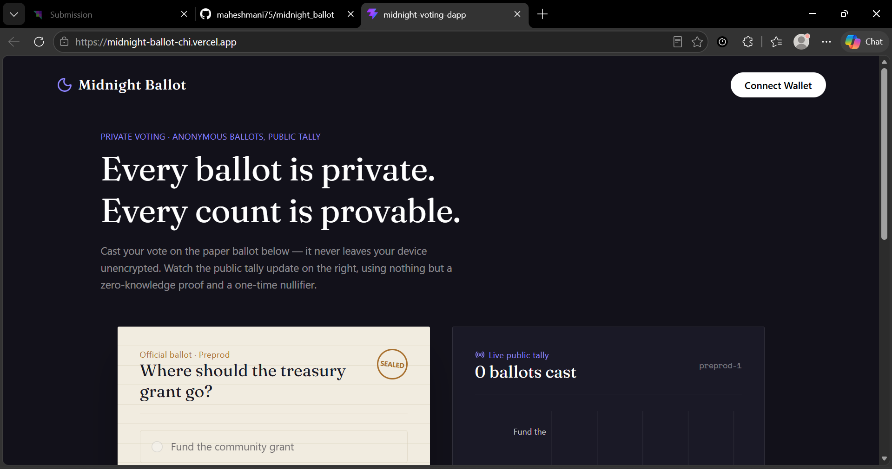
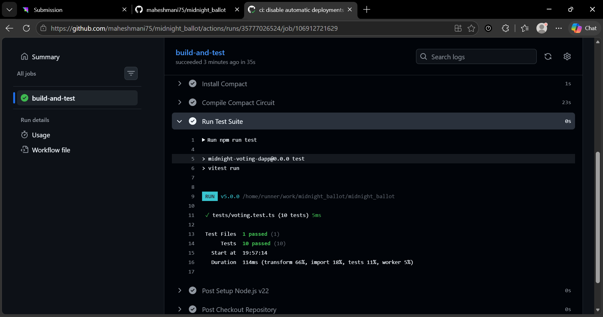
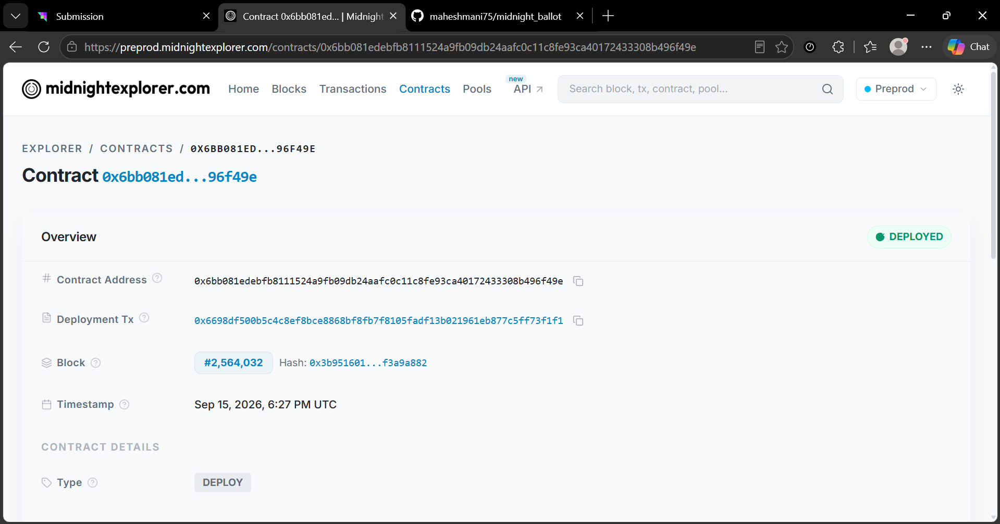

# Midnight Ballot
[](https://github.com/maheshmani75/midnight_ballot/actions/workflows/ci.yml)
> Anonymous ballots, publicly verifiable tallies — private voting on Midnight.

## Live Demo
https://midnight-ballot.vercel.app

## Demo Video
?? [Watch the 1-Minute Walkthrough Video (Google Drive)](https://drive.google.com/file/d/11DSwY501LSTGWBHD1wtN1okoUSN2FKIN/view?usp=sharing)

## Contract Address
| Network  | Address                          |
|----------|----------------------------------|
| Preprod  | `6bb081edebfb8111524a9fb09db24aafc0c11c8fe93ca40172433308b496f49e` |

- ?? **Contract on Midnight Explorer:** [View Preprod Contract](https://preprod.midnightexplorer.com/contracts/0x6bb081edebfb8111524a9fb09db24aafc0c11c8fe93ca40172433308b496f49e)

## What This Does
Midnight Ballot lets anyone vote on a fixed set of options without revealing *which* option they chose or linking their identity to their ballot, while still producing a tally anyone can independently verify by reading the public ledger.

- A voter proves membership in an eligibility set (a Merkle tree of registered voters) without revealing which leaf is theirs.
- A per-poll **nullifier**, derived from the voter's private secret, is published to stop double voting — without revealing the voter's identity or linking their votes across different polls.
- The chosen option is used **only inside the zero-knowledge circuit** to increment the matching public counter; it's never written to the ledger or emitted in any event.



## Privacy Model
- **PUBLIC:**
  - The poll's option count and open/closed state
  - The running per-option tally
  - The set of spent nullifiers (to strictly prevent double voting)
- **PRIVATE:**
  - The voter's identity and eligibility secret
  - Their Merkle path
  - Which option they selected
- **PROVED without revealing:**
  - That a registered, not-yet-voted voter cast exactly one valid ballot for a valid option — without disclosing which voter or which option to anyone, including the poll creator.

## Privacy Claim
An on-chain observer can see the total number of ballots cast and the running tally per option. What an observer cannot see or infer at any point:
1. Which wallet cast any specific ballot (no wallet or identity link exists in the proof or ledger state).
2. Which option any individual voter chose (the proof only establishes the vote was valid).
3. Any link between two ballots cast by the same voter in *different* polls (nullifiers are derived per-poll).

## Tech Stack
- **ZK Smart Contract:** Compact (`contracts/voting.compact`) compiled with Midnight Compact compiler
- **Network:** Midnight Preprod
- **Frontend:** React 19, TypeScript, Vite, Tailwind CSS v4
- **Charts:** Recharts (live public tally)
- **Icons:** lucide-react
- **Testing:** Vitest (10 tests covering circuit logic, ledger state transitions, and privacy guarantees)
- **CI/CD:** GitHub Actions (`.github/workflows/ci.yml`)

## Prerequisites
- Node.js v22+
- npm v10+
- [Compact compiler](https://docs.midnight.network) (`compactc`) installed and on your `PATH`
- Lace wallet (or another Midnight-compatible wallet) configured for Preprod

## Setup & Run Locally
```bash
# 1. Clone the repository
git clone https://github.com/maheshmani75/midnight_ballot.git
cd midnight_ballot

# 2. Install dependencies
npm install

# 3. Compile the contract (generates managed/voting/)
compactc compile contracts/voting.compact src/services/midnight/managed/voting

# 4. Point the frontend at your deployed Preprod contract
cp .env.example .env
# then edit .env and set VITE_CONTRACT_ADDRESS

# 5. Run the development server
npm run dev
```

## Run Tests
```bash
npm test
```


10 tests covering circuit logic, ledger state transitions, and the privacy guarantee. See `tests/voting.test.ts`.

## CI/CD
The repository uses GitHub Actions (`.github/workflows/ci.yml`) configured to automatically trigger on every push and pull request to the `main` branch.

The pipeline performs the following steps:
1. Checks out the code repository.
2. Installs Node.js v22 with npm cache.
3. Installs and configures the Midnight Compact compiler toolchain.
4. Compiles the Compact contract and builds generated TypeScript contract bindings.
5. Installs frontend dependencies.
6. Executes the automated test suite (`npm test`).
7. Builds the production bundle (`npm run build`).

A status badge is located at the top of this README showing live workflow status.

## Screenshots & Verification

| Screenshot | Description |
| :--- | :--- |
| **Product UI**<br> | Interactive dApp interface with live Midnight wallet integration, ballot selection, ZK proof generation, and verification status. |
| **Contract Explorer**<br> | Midnight Explorer contract page showing contract state, actions, and verification history.<br>🔗 [View on Midnight Explorer](https://preprod.midnightexplorer.com/contracts/0x6bb081edebfb8111524a9fb09db24aafc0c11c8fe93ca40172433308b496f49e) |
| **Test Output (10 Passing)**<br> | Vitest test execution output showing 10 passing tests across `tests/voting.test.ts`. |

## Product Proposal
See [PROPOSAL.md](./PROPOSAL.md) for the complete product specification, target user personas, Midnight architectural rationale, data model, and roadmap to Mainnet.
